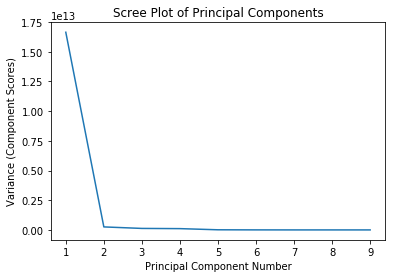
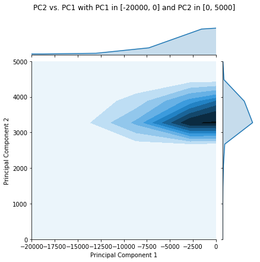

# Avocado Classifier
This Jupyter Notebook contains the code that takes in a table with information about avocados (average price, total volumne, total bags) and classifies them as either `conventional` or `organic`. This classifier, written in R, is a $k$-nearest neighbors classifier using the cartesian distance between the point in question and the points in the training set. This notebook also contains a principal component analysis of the data to see how well the points can be represented 2-dimensionally. The data set is from [Kaggle](https://www.kaggle.com/neuromusic/avocado-prices).

Contents:
* [Principal Component Analysis](#Principal-Component-Analysis)
* [$k$-NN Classifier](#%24k%24-NN-Classifier)
* [Testing the Classifier](#Testing-the-Classifier)


{:.input_area}
```python
%load_ext rpy2.ipython
import numpy as np
import pandas as pd
import seaborn as sns
import matplotlib.pyplot as plt
%matplotlib inline
```


{:.input_area}
```r
%%R
library(tidyverse)

r_avocado <- read_csv('avocado.csv')
head(r_avocado)
```


{:.output .output_data_text}
```
# A tibble: 6 x 13
  Date       AveragePrice `Total Volume` `4046` `4225` `4770` `Total Bags`
  <date>            <dbl>          <dbl>  <dbl>  <dbl>  <dbl>        <dbl>
1 2015-12-27         1.33         64237.  1037. 5.45e4   48.2        8697.
2 2015-12-20         1.35         54877.   674. 4.46e4   58.3        9506.
3 2015-12-13         0.93        118220.   795. 1.09e5  130.         8145.
4 2015-12-06         1.08         78992.  1132  7.20e4   72.6        5811.
5 2015-11-29         1.28         51040.   941. 4.38e4   75.8        6184.
6 2015-11-22         1.26         55980.  1184. 4.81e4   43.6        6684.
# … with 6 more variables: `Small Bags` <dbl>, `Large Bags` <dbl>, `XLarge
#   Bags` <dbl>, type <chr>, year <dbl>, region <chr>

```


## Principal Component Analysis
Principal component analysis (PCA) is an application of the linear algebra technique of singular value decomposition (SVD), which breaks a matrix down into the product of three matrices:

$$A = U \Sigma V^T$$

where $U$ and $V$ contain the set of orthonormal eigenvectors for $AA^T$ and $A^TA$, respectively, and $\Sigma$ contains the singular values (the squareroots of the eigenvalues) of $A^TA$ (and $AA^T$) arranged in descending order along the diagonal. PCA shows how relationships between the variables in a data set contribute to its total variance, and, depending on how dependent the variables are on one another, allow you to visualize a high-dimensional data set in 2 dimensions (e.g. as a scatter plot).

To begin PCA on the `r_avocados` tibble created above, we extract the tibble from R and create a `pandas` DataFrame in Python, and then extra the desired numerical columns (all except `Date`, `type`, `year`, and `region`) as a `numpy` matrix. We the normalize the matrix (that is, center the variables about 0 by subtracting out the mean of the variable and then divided by $\sqrt{n}$, where $n$ is the number of observations). Finally, we use the `linalg` sublibrary of `numpy` to compute the SVD of `normed_avocados`.


{:.input_area}
```python
avocado = %Rget r_avocado
avocado_attributes = avocado.iloc[:,1:10].values
normed_avocados = (avocado_attributes - np.mean(avocado_attributes)) / np.sqrt(len(avocado_attributes)) 
u, sigma, vt = np.linalg.svd(normed_avocados, full_matrices=False)
```


### Scree Plot
While you can apply PCA to any numerical data set, it is important to know whether or not PCA accurately reflects changes in the data; that is, can you reduce the dimension of the data set so much without (much) loss of generality? The way to check this is to plot a "scree plot" of the singular values, which is just a plot of the squares of the values in $\Sigma$ versus the principal component number (i.e. the columber number in $\Sigma$). If the first 1 or 2 principal components are very high in the $y$ direction relative to the other principal components, then you can get a pretty good representation of your data in 2D.

Looking at the plot below, because the first principal component is so high relative to all the others, we should be OK to perform PCA on this data set.


{:.input_area}
```python
sns.lineplot(x = range(1, len(sigma) + 1), y = sigma**2)
plt.title('Scree Plot of Principal Components')
plt.xlabel('Principal Component Number')
plt.ylabel('Variance (Component Scores)');
```


{:.output .output_png}



The actual PCA is done by plotting the product of the values in the normalized matrix times the first two right-singular vectors (that is, the first two columns of $V$). Because SVD (and `np.lingalg.svd`) returns $V^T$, we need to take $(V^T)^T$ in order to be able to multiply the matrices. Then we use `seaborn` to plot a scatterplot of PC1 vs. PC2, color-coding by the `type` column.


{:.input_area}
```python
avocados_2d = normed_avocados @ vt.T[:, 0:2]

sns.scatterplot(x = avocados_2d[:, 0], y = avocados_2d[:, 1], hue = avocado['type'])
plt.title("PC2 vs. PC1 for Avocado Data by type")
plt.xlabel("Principal Component 1")
plt.ylabel("Principal Component 2");
```


{:.output .output_png}


It looks like there is actually a lot of overlap, especially closer to 0 along PC1. So, in order to reduce overplotting, we'll use `sns.jointplot()` to plot a topographical version of the overplotted portion of the scatterplot to indicate the density of the points. This will also use kernel density estimation to estimate the density of each of the principal components.


{:.input_area}
```python
ax = sns.jointplot(x = avocados_2d[:, 0], y = avocados_2d[:, 1], kind = 'kde', xlim = (-20000, 0), ylim = (0, 5000))
ax.set_axis_labels("Principal Component 1", "Principal Component 2")
plt.suptitle("PC2 vs. PC1 with PC1 in [-20000, 0] and PC2 in [0, 5000]")
plt.subplots_adjust(top=0.9);
```


{:.output .output_png}



This plot shows where the overplotting issue is localized in the scatterplot above. While it appears in the scatterplot that the range \[-100000, 0\] along PC1 and \[-10000, 10000\] along PC2 contain the overplotting issues, the joint plot shows that the overplotting is actually _much_ more localized than that.

## $k$-NN Classifier
This cell selects the 4 columns we will use from the original table (three data point columns and the type column) and shuffles the rows of the csv file and separates them into a training set, to which the avocado to be classified will be compared, and a test set, to test the accuracy of the classifer once it is built. The test set will retain its `type` column so that we know what proportion of avocados the classifier gets correct. The training set has 18,000 rows and the test set has 249.


{:.input_area}
```r
%%R
av <- r_avocado %>%
    select(AveragePrice, 'Total Volume', 'Total Bags', type) %>%
    sample_frac(1)
av_train <- av[1:18000,]
av_test <- av[-(1:18000),]

# ensuring all rows are capture in av_test and av_train
dim(av)[1] == dim(av_train)[1] + dim(av_test)[1]
```


{:.output .output_data_text}
```
[1] TRUE

```


### Cartesian Distances
In this section, I will define a function that finds the 3-dimensional cartesian distant between two points. This is an application of the Pythagorean Theorem. The distance between two points $(x_1, y_1, z_1)$ and $(x_2, y_2, z_2)$ is

$$d = \sqrt{(x_2-x_1)^2 + (y_2-y_1)^2 + (z_2-z_1)^2}$$

The function defined takes as arguments a table whose first 3 columns are data points and an array containing the corresponding values for the point that is being compared. It returns the table with a new column that has the distance between each row in the table and the point in the array.


{:.input_area}
```r
%%R
dist <- function (tbl, row) {
    vec <- row %>% slice(1) %>% c(recursive = TRUE) %>% unname()
    new_tbl <- as_tibble(tbl)
    distances <- sqrt((new_tbl[1] - vec[1])^2 + (new_tbl[2] - vec[2])^2 + (new_tbl[3] - vec[3])^2)
    new_tbl$distances = unlist(distances)
    new_tbl
}
```


{:.input_area}
```r
%%R
head(dist(av_train, av_test[1, 1:3]))
```


{:.output .output_data_text}
```
# A tibble: 6 x 5
  AveragePrice `Total Volume` `Total Bags` type         distances
         <dbl>          <dbl>        <dbl> <chr>            <dbl>
1         1.75         24607.        8492. organic        798660.
2         1.37          1687.         772. organic        822414.
3         1.47        716020.       92754. conventional   310420.
4         0.79        344613.       97397. conventional   483332.
5         0.99         68079.       52174. organic        739465.
6         2.93         21525.        4161. organic        803483.

```


### Majority Classification
$k$-NN classifiers work by determining what classification a majority of the $k$ points closest to a point in question have. The function `find_majority` defined below runs the `dist` function on a table and returns that output sorted by increasing distance. The function `knn` below that selects the top $k$ rows and returns the majority classification.


{:.input_area}
```r
%%R
find_majority <- function (df, df2, row_index) {
    test <- df2[row_index, 1:3]
    d <- df %>%
        dist(test) %>%
        arrange(distances)
    d
}
```


{:.input_area}
```r
%%R
head(find_majority(av_train, av_test, 1))
```


{:.output .output_data_text}
```
# A tibble: 6 x 5
  AveragePrice `Total Volume` `Total Bags` type         distances
         <dbl>          <dbl>        <dbl> <chr>            <dbl>
1         0.87        726065.      410248. conventional    10052.
2         1.19        729001.      407997. conventional    11166.
3         0.87        711564.      393543. conventional    12118.
4         0.83        725928.      414298. conventional    13150.
5         1.26        709903.      385545. conventional    19797.
6         1.16        696101.      396084. conventional    23908.

```


{:.input_area}
```r
%%R
knn <- function (df, df2, row, k) {
    sort <- find_majority(df, df2, row)
    new_df <- sort[1:k,] %>%
        count(type) %>%
        arrange(desc(n))
    new_df[1, 1]
}
```


{:.input_area}
```r
%%R
knn(av_train, av_test, 1, 7)
```


{:.output .output_data_text}
```
# A tibble: 1 x 1
  type        
  <chr>       
1 conventional

```


## Testing the Classifier
For an example, I will text how accurate the 7-nearest neighbors classifer is. The `test_accuracy` function defined below runs the classifier on all rows of the `av_test` table (the entire test set), and then returns the proportion of rows that were correctly classified.


{:.input_area}
```r
%%R
test_accuracy <- function (train, test, k) {
    indices <- 1:dim(test)[1]
    classed <- sapply(indices, (function(i){knn(train, test, i, k)}))
    classed_test <- as_tibble(test)
    classed_test$kNN.class <- classed
    sum(classed_test$kNN.class == classed_test$type) / dim(classed_test)[1] 
}
```


{:.input_area}
```r
%%R
test_accuracy(av_train, av_test, 7)
```


{:.output .output_data_text}
```
[1] 0.9196787

```


### Optimizing $k$
In order to determine how many nearest neigbors would be best to run on a random avocado, this second determines the optimal value of $k$ based on the training set. It will run through the classifier for odd integer values 1 through 99, and return a table with the accuracy of each value.


{:.input_area}
```r
%%R
results <- tibble(.rows = 50)
results$k <- seq(1, 100, by = 2)
accuracy <- sapply(results$k, (function(k){test_accuracy(av_train, av_test, k)}))
results$accuracy <- unlist(accuracy)
head(arrange(results, desc(accuracy)))
```


{:.output .output_data_text}
```
# A tibble: 6 x 2
      k accuracy
  <dbl>    <dbl>
1    37    0.944
2    77    0.944
3    35    0.940
4    39    0.940
5    69    0.940
6    71    0.940

```


The results of this test change depending on the training and test sets, so the best way to get the value of $k$ that is most accurate most of the time is to bootstrap the training and test sets, which will be done in Python. The R function `bootstrap_data_sets` shuffles the `r_avocado` table loaded into R earlier and returns a tibble with the desired columns. The Python `bootstrap_avocado` function gets this table using `%Rget` and returns two DataFrames, the training and test sets.


{:.input_area}
```r
%%R
bootstrap_data_sets <- function () {
    av <- r_avocado %>%
        select(AveragePrice, 'Total Volume', 'Total Bags', type) %>%
        sample_frac(1)
    av
}
```


{:.input_area}
```python
def bootstrap_avocados():
    %R bootstrapped_avocados <- bootstrap_data_sets()
    av = %Rget bootstrapped_avocados
    return av[0:18000], av[18000:]
```


In the cell below, we create a new DataFrame `optimal_k` which will contain the value of $k$ as the rows (and the index) and column $i$ of the DataFrame will be the accuracy for each value of $k$ on repetition $i$ of the bootstrap. That means that entry $(i, j)$ of the DataFrame below is the accuracy of $k=2i+1$ on repetition $j$.


{:.input_area}
```python
reps = 1000
optimal_k = pd.DataFrame({'k' : range(1, 100, 2)}).set_index('k')

for i in range(1000):
    accuracies = []
    train, test = bootstrap_avocados()
    for k in range(1, 100, 2):
        %Rpush k
        %Rpush train
        %Rpush test
        %R train <- as_tibble(train)
        %R test <- as_tibble(test)
        %R accuracy <- test_accuracy(train, test, k)
        accuracy = %Rget accuracy
        accuracies += [accuracy]
    optimal_k.loc[:,i] = accuracies
    
optimal_k
```

