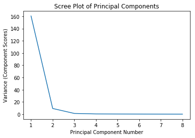
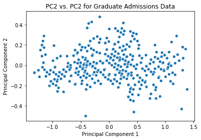

# Graduate Admissions
This data set concerns test scores and other admissions variables for a Graduate program and the chance of admission for each student. The first portion of this notebook performs a principal component analysis of the data set in order to reduce its dimensionality. The data set is from [Kaggle](https://www.kaggle.com/mohansacharya/graduate-admissions).


{:.input_area}
```python
import pandas as pd
import numpy as np
import matplotlib.pyplot as plt
import seaborn as sns
%matplotlib inline

# read table
admissions = pd.read_csv('admissions_predictions.csv', index_col='Serial No.').rename({'Chance of Admit ' : 'Chance of Admit'}, axis=1)
admissions.head()
```


<div markdown="0" class="output output_html">
<div>
<style scoped>
    .dataframe tbody tr th:only-of-type {
        vertical-align: middle;
    }

    .dataframe tbody tr th {
        vertical-align: top;
    }

    .dataframe thead th {
        text-align: right;
    }
</style>
<table border="1" class="dataframe">
  <thead>
    <tr style="text-align: right;">
      <th></th>
      <th>GRE Score</th>
      <th>TOEFL Score</th>
      <th>University Rating</th>
      <th>SOP</th>
      <th>LOR</th>
      <th>CGPA</th>
      <th>Research</th>
      <th>Chance of Admit</th>
    </tr>
    <tr>
      <th>Serial No.</th>
      <th></th>
      <th></th>
      <th></th>
      <th></th>
      <th></th>
      <th></th>
      <th></th>
      <th></th>
    </tr>
  </thead>
  <tbody>
    <tr>
      <th>1</th>
      <td>337</td>
      <td>118</td>
      <td>4</td>
      <td>4.5</td>
      <td>4.5</td>
      <td>9.65</td>
      <td>1</td>
      <td>0.92</td>
    </tr>
    <tr>
      <th>2</th>
      <td>324</td>
      <td>107</td>
      <td>4</td>
      <td>4.0</td>
      <td>4.5</td>
      <td>8.87</td>
      <td>1</td>
      <td>0.76</td>
    </tr>
    <tr>
      <th>3</th>
      <td>316</td>
      <td>104</td>
      <td>3</td>
      <td>3.0</td>
      <td>3.5</td>
      <td>8.00</td>
      <td>1</td>
      <td>0.72</td>
    </tr>
    <tr>
      <th>4</th>
      <td>322</td>
      <td>110</td>
      <td>3</td>
      <td>3.5</td>
      <td>2.5</td>
      <td>8.67</td>
      <td>1</td>
      <td>0.80</td>
    </tr>
    <tr>
      <th>5</th>
      <td>314</td>
      <td>103</td>
      <td>2</td>
      <td>2.0</td>
      <td>3.0</td>
      <td>8.21</td>
      <td>0</td>
      <td>0.65</td>
    </tr>
  </tbody>
</table>
</div>
</div>


## Principal Component Analysis
Principal component analysis (PCA) is a tool to help visualize higher-dimensional data in 2 dimensions (e.g. as a scatterplot). It is founded in the linear algebra technique of singular value decomposition. For a detailed explanation of PCA, see the PCA section of my [avocado notebook]("../avocado/avocado#principal-component-analysis"). To begin performing the PCA, we first make a scree plot to determine if the data can be well represented in 2 dimensions.


{:.input_area}
```python
# extracting the df as a numpy matrix
admissions_matrix = admissions.values

# normalizing the data within each column
normed_admissions = (admissions_matrix - np.mean(admissions_matrix, axis=0))/ np.sqrt(admissions_matrix.shape[0])

# performing SVD on the matrix
u, sigma, vt = np.linalg.svd(normed_admissions, full_matrices=False)
```


{:.input_area}
```python
# plotting the scree plot
sns.lineplot(x = range(1, 9), y = sigma**2)
plt.title('Scree Plot of Principal Components')
plt.xlabel('Principal Component Number')
plt.ylabel('Variance (Component Scores)');
```


{:.output .output_png}



Based on how high PC1 and PC2 are relative to the other principal components, the data should be well-represented in 2D. We now use `seaborn` to plot a scatterplot of PC2 vs. PC1.


{:.input_area}
```python
admissions_2d = normed_admissions @ vt.T[:, 0:2]

sns.scatterplot(x = admissions_2d[:,0], y = admissions_2d[:,1])
plt.title("PC2 vs. PC2 for Graduate Admissions Data")
plt.xlabel("Principal Component 1")
plt.ylabel("Principal Component 2");
```


{:.output .output_png}



